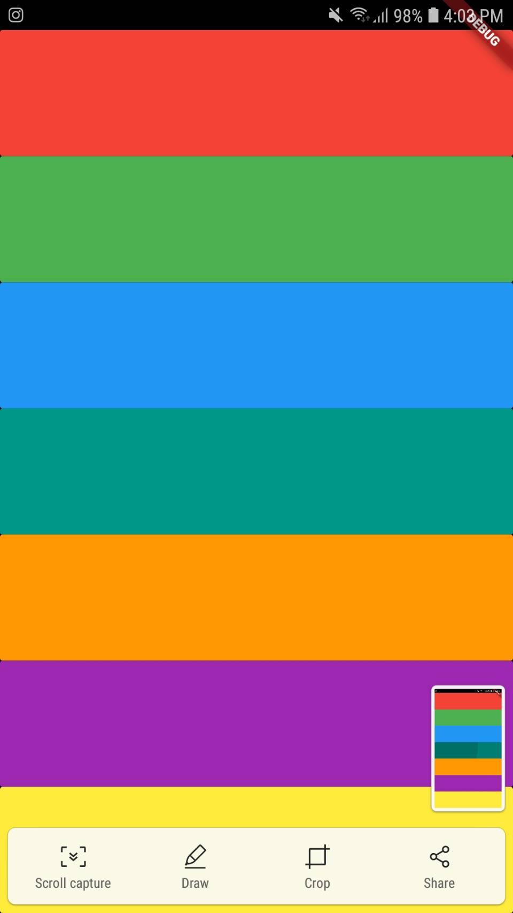

# xylophone_flutter

Flutter Xylophone - beginner app. We have used Audio_Cache to create a player instance. 

### Youtube Tutorial: https://www.youtube.com/watch?v=WSJPhwVGd58

## Getting Started

This project is a starting point for a Flutter application.

## Essentials
> Add the package into the pubspec.yaml file.
- [AudioPlayer](https://pub.dev/packages/audioplayers)
> You have to import Audio_Cache as we are playing the audio files that are local. 

## Visuals

